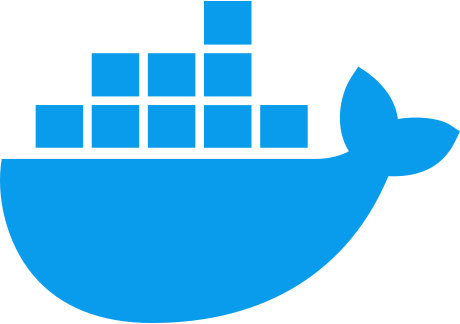

    <picture>
    <source srcset="https://media.giphy.com/media/CwTvSiWflgCGKgz5eb/giphy.gif" media="(prefers-color-scheme: dark)" />
    
    </picture>
    
    <h1>
    Hey there, I'm Taras!
    
    </h1>

### 🖨️ About Me :

Welcome to my GitHub profile - here I share my projects and learn new things.

- 🔭 I'm currently **studying to become a Full Stack developer**.
- 🌱 I'm currently **learning React and actively improving my JavaScript
  skills**.
- 👯 I'm open **to new collaborations and projects, and I'm ready for
  challenges**.
- 🤔 I’m looking for help with **improving my programming skills**.
- 📫 How to reach me: **[ vasylkiv.t@gmail.com ]**.
- ⚡ Fun fact: Everything starts with **"Hello, world!"**.

    

    

    
    

### My stack and tools :

  &nbsp&nbsp;
  &nbsp&nbsp;
  &nbsp&nbsp;
  &nbsp&nbsp;
  &nbsp&nbsp;
  &nbsp;&nbsp;
  &nbsp&nbsp;
  &nbsp&nbsp;
  &nbsp&nbsp;
  &nbsp&nbsp;
  &nbsp&nbsp;
  &nbsp&nbsp;
  &nbsp&nbsp;
  &nbsp&nbsp;
  &nbsp&nbsp;
  &nbsp&nbsp;
  &nbsp&nbsp;
  &nbsp;&nbsp;
  &nbsp&nbsp;
  &nbsp;&nbsp;
  &nbsp;&nbsp;
  &nbsp;&nbsp;
  &nbsp;&nbsp;
  &nbsp;&nbsp;
  &nbsp;&nbsp;
  &nbsp;&nbsp;
  &nbsp;&nbsp;
  &nbsp;&nbsp;

